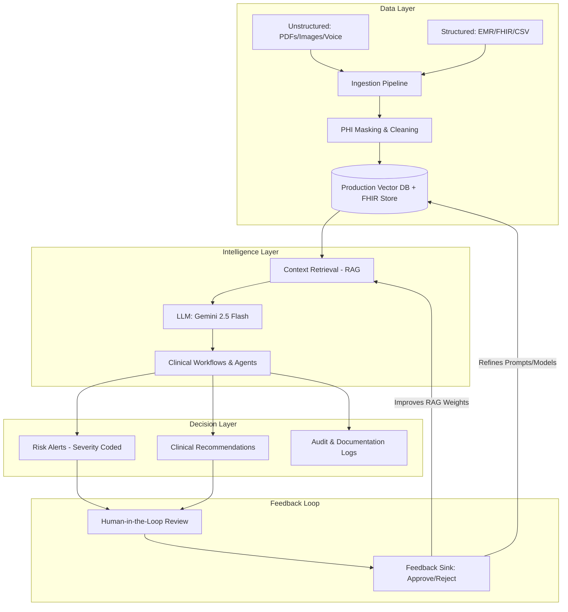

# AI Care Coordinator: Production System Architecture

This document outlines the blueprint for a production-grade Clinical Intelligence System. It transitions the current prototype from a file-based tool to a scalable, secure, and feedback-driven clinical command center.

## 🏗️ System Overview Diagram

---

## 1. Data Layer: The Clinical Foundation

### Data Sources
*   **Unstructured**: Clinical intake notes, discharge summaries, caregiver WhatsApp messages, and voice memos (converted via Whisper/Gemini).
*   **Structured**: FHIR-compliant patient records, vital trend CSVs, and medication JSON exports.

### Ingestion & Transformation
*   **Multimodal Pipeline**: Uses OCR (Vision) for handwritten notes and parsing for structured data.
*   **Cleaning Strategy**:
    *   **PHI Scrubbing**: Local NER (Named Entity Recognition) to redact PII before cloud transmission.
    *   **Normalization**: Converting disparate units (e.g., blood glucose) into unified clinical standards.

---

## 2. Intelligence Layer: Reasoning & Retrieval

### AI Approach
*   **LLM Usage**: We utilize **Prompting & In-Context Learning** with `gemini-2.5-flash`. Highly specific clinical prompts allow for rapid iteration without the maintenance cost of fine-tuning.
*   **RAG Architecture**:
    *   **Snippet Retrieval**: Instead of passing entire documents, we retrieve the most relevant 10-15 "Snippets" (top-k retrieval) based on the query.
    *   **Grounded Generation**: Output is strictly constrained to retrieved evidence to eliminate hallucinations.

### Agents vs Workflows
*   **Directed Workflows**: High-stakes clinical assessments (Risk Scoring) follow strict, deterministic workflows.
*   **Conversational Agents**: The "Ask AI" feature uses an agentic approach to cross-reference multiple documents for complex trend analysis.

---

## 3. Decision Layer: Actionable Outputs

### Generated Outputs
*   **Risk Alerts**: Categorized into **Critical (P1)**, **Requires Review (P2)**, and **Stable (P3)**.
*   **Recommendations**: Prioritized clinical actions (e.g., "Schedule Pulmonary Consult") mapped directly to source evidence.
*   **Automations**: Automatic generation of summary reports and prepopulated EMR templates for human signatures.

---

## 4. Feedback Loop: Continuous Improvement

### Human-in-the-Loop (HIL)
*   **Clinical Review**: Every AI recommendation requires a human "Approve" or "Reject" action.
*   **Action Tracking**: System logs how clinicians interact with findings (e.g., "AI flagged High Risk, Doctor downgraded to Medium").

### System Learning
*   **Feedback Sink**: Rejections are tagged with reasons (e.g., "Misidentified symptom"). These form a **Golden Dataset** for:
    *   **Prompt Engineering**: Refining instructions based on edge cases.
    *   **RAG Tuning**: Improving the relevance and weighting of specific source types (e.g., prioritizing Doctor notes over Nurse notes if they conflict).

---

> [!IMPORTANT]
> **Production Scaling**: In a live environment, the local `data/patients.json` would be replaced by a managed PostgreSQL instance with a Vector extension (pgvector) and a FHIR-compliant API layer.
